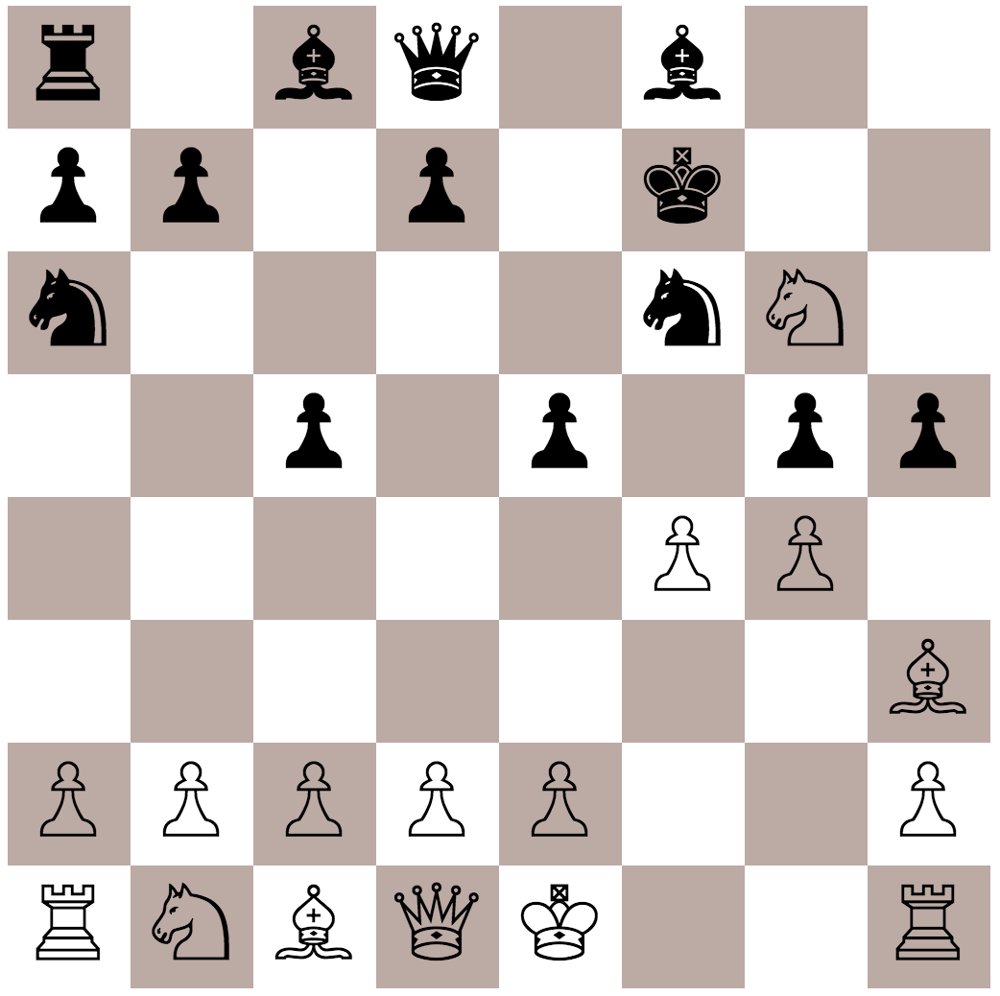

# A React/Redux Powered Chess App

Features include;
- Virtual Opponent
- Available moves visible on piece click
- Unicode powered visuals :)
- Responsible (mobile++)
- Red flashing animation if a piece is targetted

Under the hood;
- React
- Redux
- Redux thunk
- [Chess.js](https://github.com/jhlywa/chess.js/blob/master/README.md) for managing game via FEN notation.
- Generated components mapped with dynamic classnames (and Tachyons)

Goals;
- Build support to handle *bestmove.js* logic... i.e. make a function that takes a FEN string and returns a next response move with good logic (leveraging possibilities of future moves)
- Build state tree to contain further information about game status (in Check?), and handle responses of pieces/tiles to game status
- Display dead-pieces at side of boards
- Add tests
